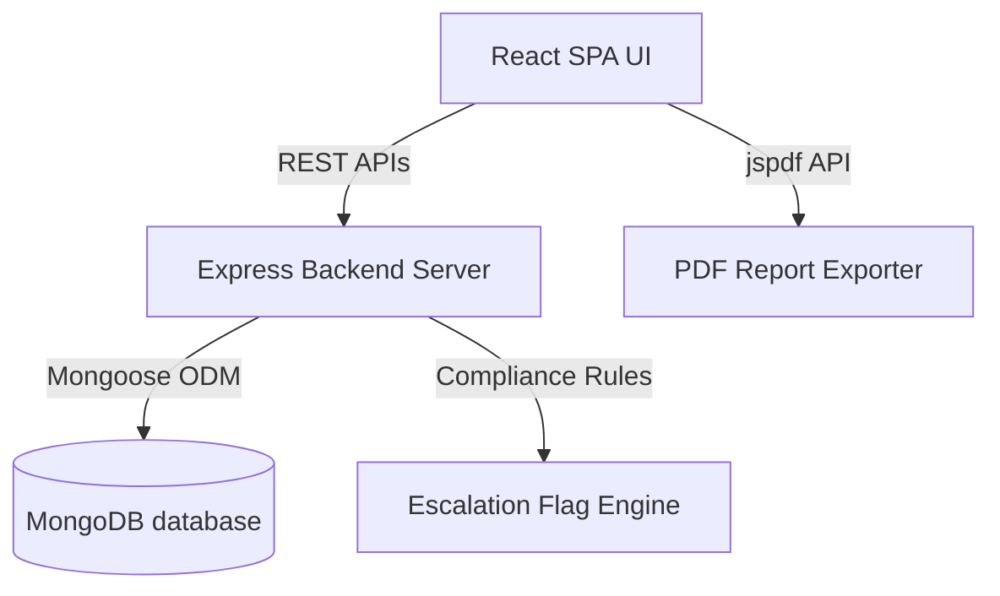

# Process Analyst Monitoring Module Documentation

This document describes the technical architecture, data model, APIs, frontend interface, compliance engine, and reporting features of the **Process Analyst Monitoring Module** built for NetBounce Placement LLC.

---

## 🏗️ Architectural Overview

The Process Analyst Monitoring Module is integrated into the NetBounce placement operations portal. It provides real-time compliance tracking, daily snapshots, escalation flags, and executive summary reports.

---

## 🗄️ Database Schemas & Data Model

The module utilizes five core MongoDB collections:

### 1. Daily Performance Records (`processmonitors`)
Stores candidate monitoring metrics submitted daily by the Process Analyst. Once submitted, records are **immutable** (editing and deleting are disabled).

| Field Name | Type | Description |
| :--- | :--- | :--- |
| `monitoringDate` | Date | The date of the tracking snapshot (defaults to `now`). |
| `recruiterName` | String | Name of the Recruiter. |
| `seniorRecruiter` | String | Name of the Senior Recruiter. |
| `teamLead` | String | Default Team Lead ("Shilp"). |
| `candidateName` | String | Name of the candidate. |
| `candidateStatus` | String | Status (`Active`, `Hold`, `Backout`, `Placed`). |
| `statusComment` | String | Explanatory note (mandatory if status changes from `Active`). |
| `longApplications` | Number | Count of long form applications. |
| `shortApplications` | Number | Count of short form applications. |
| `totalApplications` | Number | Sum of long and short applications. |
| `overallStatus` | String | Status indicator (`achieved`, `below_target`, `missed`). |
| `connectedTwiceToday` | String | Recruiter connectivity status (`yes`, `no`). |
| `connectionReason` | String | Mandatory description if recruiter connected less than twice. |
| `communicatedInEnglish` | String | English compliance flag (`yes`, `no`). |
| `englishComplianceReason` | String | Mandatory description if English guidelines were violated. |
| `interviewCount` | Number | Count of candidate interviews scheduled today. |
| `interviewStatus` | String | Current outcome (`Scheduled`, `Completed`, `Rejected`, `Feedback Pending`, `Selected`). |
| `interviewLegitimacy` | String | Legitimacy status (`Legit`, `Not Legit`, `Pending Verification`). |
| `tlVerificationComment` | String | Mandatory comment from Team Lead once legitimacy is verified. |
| `complianceScore` | Number | Numerical metric calculated automatically (0–100). |
| `dailyObservation` | String | Process remarks or observations. |
| `dailyChallenge` | String | Process challenges faced. |
| `processAnalystRemarks` | String | Remarks logged by the Analyst. |

### 2. Status Audit Trail (`statusaudits`)
Automatically tracks candidate status adjustments.
* **Fields:** `candidateName`, `oldStatus`, `newStatus`, `changedBy`, `changedDate`, `reason`.

### 3. Compliance Escalation Flags (`escalationflags`)
Stores auto-escalated compliance red flags.
* **Severity Levels:** `critical` (Backout, English violations), `high` (Missing Follow-Ups), `medium` (Below Target, Missing Legitimacy).
* **Fields:** `flagType`, `recruiterName`, `candidateName`, `teamLead`, `monitoringDate`, `severity`, `description`, `resolved`, `resolvedAt`, `resolvedNote`.

### 4. Snapshots (`weeklysnapshots` / `monthlysnapshots`)
Saves aggregated reports frozen at a specific point in time to prevent retrospect modifications.

---

## 🔌 API Endpoints

### 1. Core Operations
* **`POST /api/monitoring`**
  * Submits a daily entry. Calculates target levels, compliance scores, runs audit logs, and triggers the escalation engine.
* **`GET /api/monitoring`**
  * Fetches historical logs. Supports search queries: `recruiter`, `candidate`, `teamLead`, `seniorRecruiter`, `startDate`, `endDate`, `status`, and `interviewLegitimacy`.
* **`PATCH /api/monitoring/:id`**
  * **Blocked (403 Forbidden)**: Responds with `"Daily monitoring records are immutable. Editing is not permitted for compliance."`
* **`DELETE /api/monitoring/:id`**
  * **Blocked (403 Forbidden)**: Responds with `"Daily monitoring records are immutable. Deletion is not permitted for compliance."`

### 2. Analytics & Reporting
* **`GET /api/monitoring/executive-summary`**
  * Aggregates key compliance stats and team lead legitimacy summary stats.
* **`GET /api/monitoring/trend-analysis`**
  * Accept `period` query parameter (`weekly` or `monthly`). Computes WoW/MoM recruiter improvement percentages.
* **`GET /api/monitoring/candidate-timeline?candidateName=Name`**
  * Compiles chronological history of status changes, daily logs, and follow-ups.

---

## 🎯 Compliance Scoring & Escalation Logic

### Compliance Formula (Max 100%)
* **Long Form Target met (>= 60):** `+25%`
* **Short Form Target met (>= 40):** `+25%`
* **Connected twice today (Yes):** `+20%`
* **English spoken compliance (Yes):** `+15%`
* **Interview legitimacy verified (Legit):** `+15%`

### Auto-Escalation Red Flags
On every form submission, the backend checks for compliance rules:
1. **Critical:** Candidate status changed to `Backout`.
2. **Critical:** Language compliance set to `No` (`english_violation`).
3. **High:** Recruiter did not connect twice today (`missing_follow_up`).
4. **Medium:** Target score is below requirement (`below_target`).
5. **Medium:** Legitimacy is `Not Legit` (`missing_legitimacy`).

---

## 📊 Executive & Recruiter PDF Reports

Recruiter reports are exported into corporate-themed PDFs containing:
1. Branded Header (NetBounce logo colors).
2. KPI Metrics Summary.
3. Candidate Compliance Grid.
4. Active Red Flags section.
5. **Daily Context & Observations table** (collates Date, Candidate, Observations, and Remarks).
6. Performance Audit Trail.
